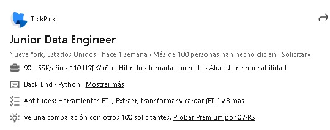
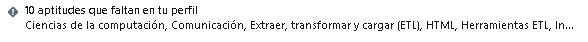
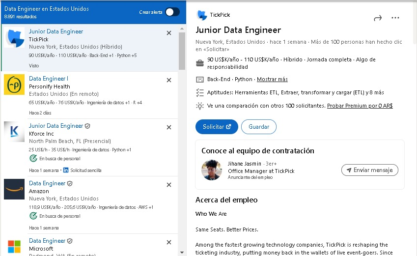
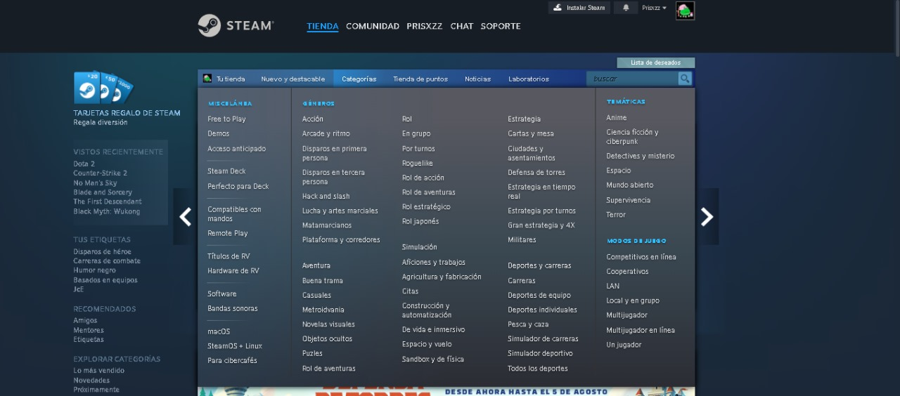
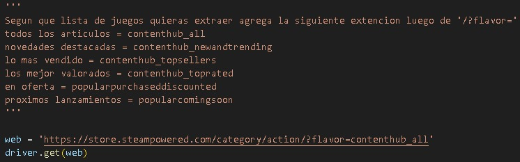

<h1 align="center">WEB-SCRAPING</h1>

  

<h1 align="center">Selenium</h1>

  

<h1 align="center">Introducción</h1>

Bienvenido a este repositorio de proyectos de web scraping, donde encontrarás herramientas diseñadas para extraer datos valiosos de dos populares plataformas: LinkedIn y Steam. Este repositorio contiene scripts y utilidades para realizar scraping de datos de puestos de trabajo publicados en LinkedIn y de información de juegos disponibles en Steam.

<h1 align="center">Estructura del Repositorio</h1>

  
  - Scripts/: Contiene scripts y utilidades para realizar scraping de ofertas de empleo en LinkedIn.
    - linkedin.py: Script para puestos laborales en LinkedIn.
    - steam_juegos_cat.py: Script de lista de juegos por categoría.
    - steam_top_juegos.py: Script de Steam con los top juegos por jugadores actuales y pico diario.
    
  - csv/: Datos extraídos en formatos estructurados CSV.
    - cat_juegos_steam.csv: Dataset de juegos por categoría.
    - job_details.csv: Dataset de detalles de puestos en LinkedIn.
    - links_usa.csv: Dataset de enlaces de puestos en LinkedIn.
    - top_juegos.csv: Dataset de top juegos por jugadores activos.
    
  - scv/: Imágenes asociadas al README.

<h1 align="center">LinkedIn</h1>

El proceso de este script se divide en dos partes:
  
  - **Primera Parte**:
    Inicia logueando en la página de LinkedIn. Luego de este paso, se dirige a la URL de trabajos. En la misma, busca los elementos para insertar el puesto y la ubicación predefinida en el archivo. Realiza la búsqueda y comienza un ciclo while con la condición true, el cual ejecuta principalmente la función que extraerá los enlaces de las postulaciones. Antes de esto, comienza a scrollear hacia abajo para cargar todos los puestos sin inconvenientes. Luego, extrae los enlaces y ejecuta la función para el cambio de página que retorna true. Si no se encuentra el botón para pasar a la siguiente página, retorna false. Estos enlaces extraídos se guardan en una lista, la cual se usará luego para crear un DataFrame y exportar el archivo.
    

      
    

  - **Segunda Parte**:
    Carga el archivo guardado en la primera parte. Crea una lista en la cual se guardarán diccionarios e inicia un ciclo for que devolverá los enlaces del DataFrame. Si este enlace no es nulo, se ejecuta una función de extracción de información, la cual está compuesta por varias sentencias try. La primera realiza clic en el elemento de "ver más" para extraer correctamente la información de la descripción. Luego, cada sentencia try siguiente está definida para extraer un elemento, como el nombre del puesto, la ubicación, el tipo de empleo, etc. Estas sentencias try individuales evitan que la falta de un elemento impida extraer la información de los demás. Al concluir la función, se retorna un diccionario que se guarda en la lista mencionada anteriormente. Esta lista se convierte en un DataFrame y se exporta en formato CSV.
    

      
    

    

      
    

    

      
    

    
  - **Optimización**:
    Una optimización recomendada es configurar el script para evitar la primera parte. Para esto, se debe configurar para que haga clic en cada postulación y extraiga la información en la ventana emergente al lado de las postulaciones.
    

      
    

    
  *`Encontraremos este proceso en el archivo Scripts/linkedin.py`*

<h1 align="center">Steam</h1>

Esta sección está compuesta por dos Scripts:
  
  - **Primer Script**:
    Este realiza una extracción de juegos por categoría. Para esto, el usuario debe entrar a Steam a través de un navegador.
    

      
    

    Al seleccionar la categoría, deberá copiar la URL y esta deberá ser pegada en el script.
    

      
    

    Posteriormente, se deberá agregar una extensión a dicha URL si el usuario desea cambiar la lista de los juegos proporcionados, ordenado por los más vendidos, los mejor valorados, etc.
    

      
    

    

      
    

    Esto ofrecerá al usuario extraer datos de la lista de juegos solicitada, como el nombre, categorías, fecha de lanzamiento, tipo de reseñas, cantidad de reseñas, precio y enlace del juego.
  
  - **Segundo Script**:
    Este extrae los datos de una lista proporcionada por Steam sobre el top 100 juegos por jugadores activos, ofreciendo información del nombre, precio, jugadores actuales y pico diario.
    

      
    

  
  *`Encontraremos este proceso en los archivos Scripts/steam_juegos_cat.py y Scripts/steam_top_juegos.py`*

<h1 align="center">¿Cómo lo hice? 🤔</h1>

 

1. eleccion de libreria de web scraping.

2. Estudio de la extructura html de dichas paginas.

3. Creacion de Scripts.

<h1 align="center">Futuros Pasos ⌚</h1>

 

4. Transformacion de datos.

5. Visualización y reportes con Power Bi.

<h1 align="center">Stack Tecnológico 🔧</h1>

 

🐍 **Python**: Lenguaje utilizado para realizar Scripts.

🐼 **Pandas**: Librería de Python Utilizada para la creacion de DataFrame y exportacion/lectura de archivos.

💻 **Selenium**: Librería de Python utilizada para la extraccion de infromacion.

